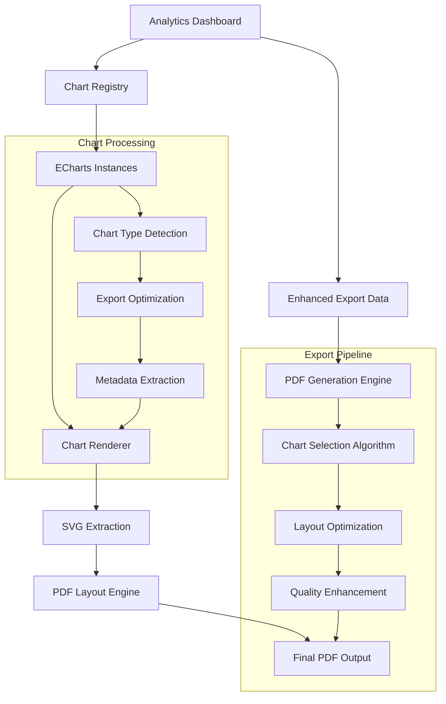
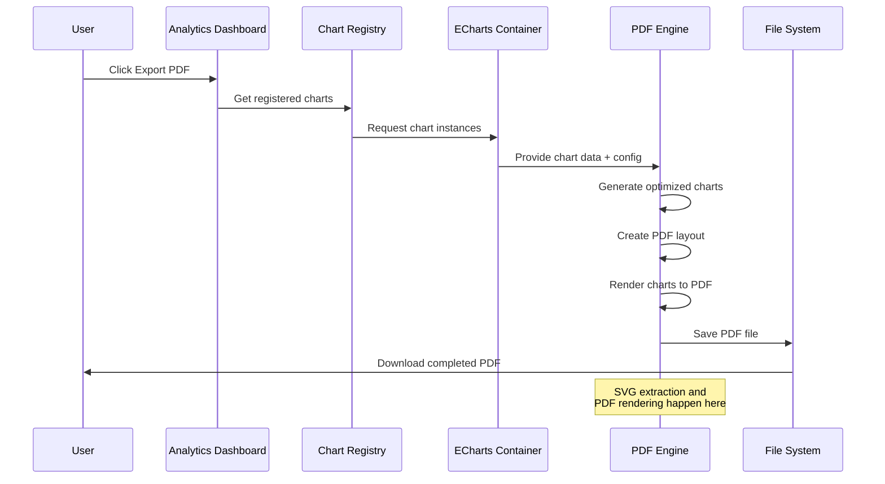
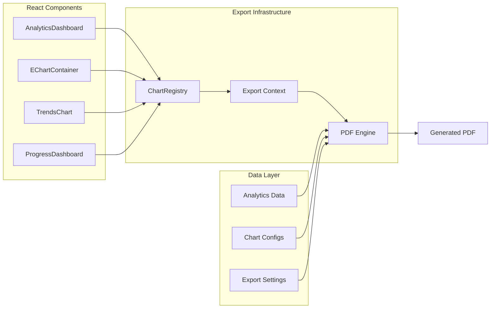
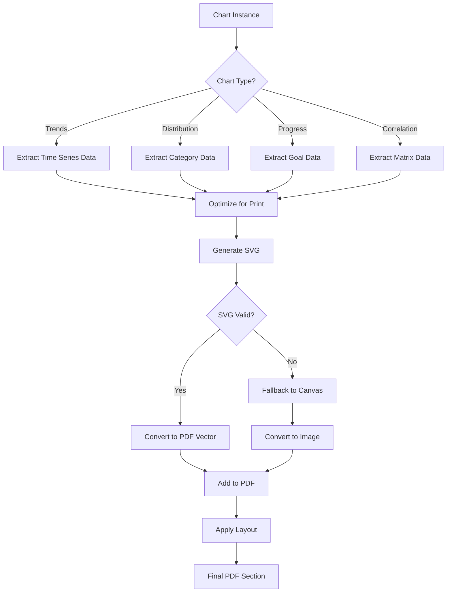

# Analytics PDF Export Implementation Plan

## Overview
This plan outlines the implementation of real analytics charts into the PDF export functionality, replacing the current simple snapshot-based approach with comprehensive chart rendering using ECharts integration.

## Current State Analysis

### Existing Components
- **AnalyticsDashboard**: Main dashboard with chart visualization tabs
- **EChartContainer**: Centralized ECharts component with theming
- **TrendsChart**: ECharts-based trend visualization
- **ProgressDashboard**: Goal progress with multiple chart types
- **analyticsExport.ts**: Current PDF export functionality using html2canvas

### Current PDF Export Limitations
- Basic HTML element capture using html2canvas
- No direct ECharts integration
- Limited chart quality and customization
- Static content without interactive insights

## Implementation Plan

### Phase 1: Chart Capture Infrastructure
**Goal**: Build foundation for capturing ECharts instances for PDF export

#### Task 1.1: Enhanced Chart Registry System
**Subtasks**:
- [ ] Create `ChartRegistry` singleton to track active ECharts instances
- [ ] Add chart registration methods with unique IDs
- [ ] Implement chart instance cleanup on component unmount
- [ ] Add metadata tracking (chart type, student ID, timestamp)

**Technical Details**:
```typescript
interface ChartRegistration {
  id: string;
  instance: EChartsInstance;
  type: 'trends' | 'progress' | 'correlation' | 'distribution';
  metadata: {
    studentId: string;
    dateRange?: { start: Date; end: Date };
    filters?: Record<string, any>;
  };
}

class ChartRegistry {
  private charts = new Map<string, ChartRegistration>();
  
  register(registration: ChartRegistration): void;
  unregister(id: string): void;
  getChart(id: string): ChartRegistration | undefined;
  getChartsByStudent(studentId: string): ChartRegistration[];
  cleanup(): void;
}
```

#### Task 1.2: ECharts SVG Export Integration
**Subtasks**:
- [ ] Extend EChartContainer to support SVG rendering mode
- [ ] Add export-specific chart configuration (higher DPI, optimized colors)
- [ ] Implement direct SVG extraction from ECharts instances
- [ ] Add fallback to canvas rendering for complex charts

**Technical Implementation**:
- Utilize ECharts' built-in `getDataURL()` and `getSvg()` methods
- Configure export-specific options (backgroundColor, pixelRatio)
- Handle different chart types (line, bar, pie, scatter)

#### Task 1.3: Chart Context Provider
**Subtasks**:
- [ ] Create React context for chart export management
- [ ] Provide hooks for chart registration and export
- [ ] Implement export queue management for multiple charts
- [ ] Add progress tracking for export operations

### Phase 2: Analytics Data Pipeline Enhancement
**Goal**: Improve data preparation for comprehensive PDF reports

#### Task 2.1: Enhanced Analytics Export Data Structure
**Subtasks**:
- [ ] Extend `AnalyticsExportData` interface to include chart configurations
- [ ] Add comprehensive metadata for each chart type
- [ ] Implement data aggregation specifically for PDF export
- [ ] Create export-optimized data transformations

**Data Structure Enhancement**:
```typescript
interface EnhancedAnalyticsExportData extends AnalyticsExportData {
  charts: {
    trends: {
      config: EChartsOption;
      data: TrendDataPoint[];
      insights: string[];
    };
    distribution: {
      config: EChartsOption;
      data: DistributionDataPoint[];
      insights: string[];
    };
    correlations: {
      config: EChartsOption;
      data: CorrelationMatrix;
      insights: string[];
    };
    progress: {
      config: EChartsOption;
      data: ProgressDataPoint[];
      insights: string[];
    };
  };
  exportSettings: {
    includeRawData: boolean;
    chartQuality: 'standard' | 'high' | 'print';
    colorScheme: 'default' | 'high-contrast' | 'colorblind-friendly';
  };
}
```

#### Task 2.2: Smart Chart Selection Algorithm
**Subtasks**:
- [ ] Implement algorithm to determine most relevant charts for export
- [ ] Add chart priority scoring based on data significance
- [ ] Create automatic insight generation for each chart
- [ ] Implement adaptive chart sizing for PDF layout

**Algorithm Logic**:
- Score charts based on data richness and significance
- Prioritize charts with strong patterns or anomalies
- Consider date range and data volume
- Adapt to available PDF space

### Phase 3: PDF Generation Engine Overhaul
**Goal**: Replace html2canvas with direct ECharts-to-PDF rendering

#### Task 3.1: Direct ECharts PDF Rendering
**Subtasks**:
- [ ] Implement SVG-to-PDF conversion using jsPDF
- [ ] Add high-quality chart rendering with vector graphics
- [ ] Implement multi-page layout with automatic chart placement
- [ ] Add chart legends and annotations specific to PDF format

**Technical Approach**:
```typescript
class ChartToPDFRenderer {
  private pdf: jsPDF;
  
  async renderChart(
    chart: EChartsInstance, 
    config: ChartRenderConfig
  ): Promise<void>;
  
  private optimizeChartForPrint(option: EChartsOption): EChartsOption;
  private calculateChartLayout(pageSize: [number, number]): ChartLayout;
  private addChartToPage(svgData: string, layout: ChartLayout): void;
}
```

#### Task 3.2: Intelligent PDF Layout Engine
**Subtasks**:
- [ ] Create responsive PDF layout system
- [ ] Implement automatic chart sizing and positioning
- [ ] Add intelligent page breaks for chart content
- [ ] Create chart thumbnail navigation for multi-page reports

**Layout Engine Features**:
- Dynamic chart sizing based on content complexity
- Automatic multi-column layouts for smaller charts
- Intelligent page breaks to avoid chart splitting
- Header/footer integration with chart metadata

#### Task 3.3: Export Configuration Interface
**Subtasks**:
- [ ] Design user interface for PDF export options
- [ ] Add chart selection and customization controls
- [ ] Implement preview functionality before export
- [ ] Add export templates (summary, detailed, presentation)

### Phase 4: Advanced Chart Integration
**Goal**: Integrate specialized analytics charts into PDF export

#### Task 4.1: Progress Dashboard Integration
**Subtasks**:
- [ ] Integrate goal progress charts into PDF export
- [ ] Add student comparison charts for multi-student reports  
- [ ] Implement timeline-based progress visualization
- [ ] Add predictive trend charts with confidence intervals

#### Task 4.2: Correlation and Pattern Charts
**Subtasks**:
- [ ] Add correlation heatmaps with detailed annotations
- [ ] Implement pattern recognition visualization charts
- [ ] Add anomaly detection highlights in timeline charts
- [ ] Create behavioral pattern flow diagrams

#### Task 4.3: Interactive Chart Elements for PDF
**Subtasks**:
- [ ] Add QR codes linking to interactive online versions
- [ ] Implement chart data tables as PDF appendices
- [ ] Add detailed methodology explanations
- [ ] Create chart interpretation guides

### Phase 5: Quality Assurance and Optimization
**Goal**: Ensure reliable, high-quality PDF generation

#### Task 5.1: Export Performance Optimization
**Subtasks**:
- [ ] Implement chart rendering caching for large datasets
- [ ] Add progressive rendering for complex multi-chart reports
- [ ] Optimize memory usage during export process
- [ ] Add export cancellation and retry mechanisms

#### Task 5.2: Cross-Platform Testing
**Subtasks**:
- [ ] Test PDF generation across different browsers
- [ ] Verify chart quality on various devices and screen sizes
- [ ] Test with different data volumes and date ranges
- [ ] Validate accessibility features in generated PDFs

#### Task 5.3: Error Handling and Fallbacks
**Subtasks**:
- [ ] Implement graceful degradation for unsupported charts
- [ ] Add fallback to static image export when SVG fails
- [ ] Create comprehensive error reporting for export failures
- [ ] Add retry mechanisms with progressive fallbacks

## Architecture Diagrams

### System Architecture Overview


### Chart Export Data Flow


### Component Interaction Model


### Chart Processing Pipeline


## Implementation Timeline

### Week 1-2: Foundation (Phase 1)
- Chart Registry System
- ECharts SVG Export Integration
- Chart Context Provider
- Basic infrastructure testing

### Week 3-4: Data Pipeline (Phase 2)
- Enhanced Analytics Export Data Structure
- Smart Chart Selection Algorithm
- Data aggregation improvements
- Export data validation

### Week 5-7: PDF Engine (Phase 3)
- Direct ECharts PDF Rendering
- Intelligent PDF Layout Engine
- Export Configuration Interface
- Core PDF generation testing

### Week 8-9: Chart Integration (Phase 4)
- Progress Dashboard Integration
- Correlation and Pattern Charts
- Interactive Chart Elements
- Advanced visualization features

### Week 10-11: Quality Assurance (Phase 5)
- Performance Optimization
- Cross-Platform Testing
- Error Handling and Fallbacks
- Final integration testing

### Week 12: Polish and Deployment
- User acceptance testing
- Documentation completion
- Production deployment
- Performance monitoring setup

## Success Criteria

### Technical Requirements
- [ ] PDF generation time < 10 seconds for complex reports
- [ ] Chart quality suitable for professional presentation
- [ ] Support for all existing chart types
- [ ] Graceful handling of large datasets (10,000+ data points)
- [ ] Cross-browser compatibility (Chrome, Firefox, Safari, Edge)

### User Experience Requirements
- [ ] Intuitive export configuration interface
- [ ] Clear progress indication during export
- [ ] Preview functionality before final export
- [ ] Professional-quality PDF output
- [ ] Accessible PDF content with proper structure

### Quality Assurance
- [ ] Comprehensive unit test coverage (>90%)
- [ ] End-to-end testing for all export scenarios
- [ ] Performance benchmarking and optimization
- [ ] Error handling and recovery testing
- [ ] Accessibility compliance verification

## Risk Mitigation

### Technical Risks
- **Chart Rendering Failures**: Implement fallback to canvas rendering
- **Memory Issues with Large Datasets**: Add data pagination and progressive rendering
- **Cross-Platform Inconsistencies**: Extensive testing and platform-specific optimizations
- **PDF Size Issues**: Implement compression and optimization algorithms

### User Experience Risks
- **Complex Interface**: Provide sensible defaults and progressive disclosure
- **Long Export Times**: Add progress indicators and background processing
- **Quality Expectations**: Set clear expectations and provide preview functionality

### Performance Risks
- **Browser Memory Limits**: Implement streaming and chunked processing
- **Large File Generation**: Add compression and size optimization
- **Concurrent Export Requests**: Implement queue management and rate limiting

## Next Steps

1. **Review and Approval**: Review this plan with stakeholders
2. **Technical Validation**: Validate technical approaches with quick prototypes
3. **Resource Allocation**: Assign team members to specific phases
4. **Sprint Planning**: Break down tasks into 2-week sprints
5. **Dependency Management**: Identify and address external dependencies
6. **Monitoring Setup**: Establish metrics and monitoring for the implementation

## Conclusion

This comprehensive plan transforms the current basic PDF export into a sophisticated, high-quality analytics reporting system. The phased approach ensures steady progress while maintaining system stability. The focus on chart quality, user experience, and performance optimization will deliver a professional-grade export feature suitable for educational and clinical environments.
