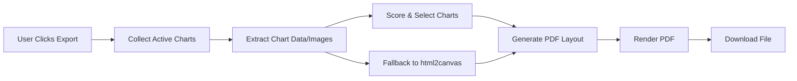
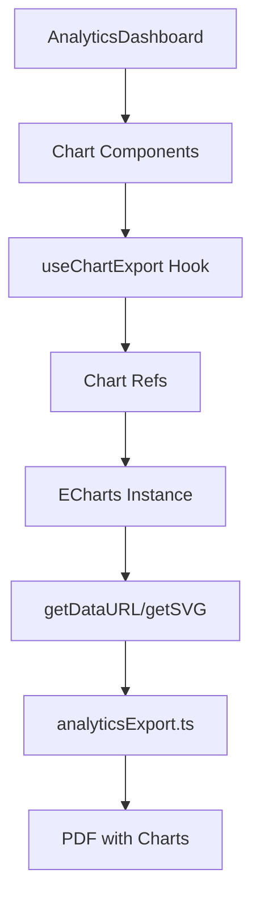

# Revised Analytics PDF Export Implementation Plan

## Executive Summary
A pragmatic, iterative approach to enhance PDF exports by leveraging existing ECharts infrastructure. Instead of rebuilding everything, we'll extend what's working and add chart capture capabilities incrementally.

## Current Reality Check

### What We Already Have
✅ **Working Components:**
- `EChartContainer` with ReactECharts integration
- `analyticsExport.ts` with functional PDF generation
- Multiple chart components (TrendsChart, ProgressDashboard, etc.)
- html2canvas already capturing chart elements

### What's Actually Missing
❌ **Key Gaps:**
- ECharts instances aren't accessible for direct export
- html2canvas quality is suboptimal for charts
- No chart data being passed to PDF export
- Limited chart variety in exported PDFs

## Revised Implementation Strategy

### Core Principle: Build on What Works
Instead of a complete overhaul, we'll:
1. Enhance existing `analyticsExport.ts` incrementally
2. Add chart capture hooks to existing components
3. Use ECharts' native export capabilities
4. Keep html2canvas as fallback

## Implementation Phases (6 Weeks Total)

---

## Phase 1: Chart Export Hook (Week 1)
**Goal:** Create a simple mechanism to capture ECharts instances

### TODO List - Week 1

#### Day 1-2: Create Chart Export Hook
- [ ] Create `src/hooks/useChartExport.ts`
  ```typescript
  export function useChartExport(chartRef: React.RefObject<ReactECharts>) {
    const getChartImage = () => chartRef.current?.getEchartsInstance().getDataURL();
    const getChartSVG = () => chartRef.current?.getEchartsInstance().renderToSVGString();
    return { getChartImage, getChartSVG };
  }
  ```
- [ ] Test hook with existing EChartContainer
- [ ] Document hook usage patterns

#### Day 3-4: Extend EChartContainer
- [ ] Add ref forwarding to EChartContainer
- [ ] Add export method props to EChartContainer
- [ ] Create helper function for chart data extraction
- [ ] Test with TrendsChart component

#### Day 5: Integration Testing
- [ ] Test chart export with different chart types
- [ ] Validate image quality and SVG output
- [ ] Create unit tests for new hook
- [ ] Document any browser compatibility issues

---

## Phase 2: Enhanced Analytics Export (Week 2)
**Goal:** Upgrade PDF export to use high-quality chart images

### TODO List - Week 2

#### Day 1-2: Upgrade analyticsExport.ts
- [ ] Add new interface for chart data:
  ```typescript
  interface ChartExportData {
    type: 'trends' | 'distribution' | 'progress' | 'correlation';
    dataURL?: string;
    svgString?: string;
    title: string;
    insights?: string[];
  }
  ```
- [ ] Modify `AnalyticsExportData` to include `chartExports: ChartExportData[]`
- [ ] Update `exportToPDF` to handle dataURL/SVG charts
- [ ] Add fallback to html2canvas if no dataURL

#### Day 3-4: Implement Chart Collection
- [ ] Create chart collection utility in AnalyticsDashboard
- [ ] Add chart refs to key visualizations
- [ ] Implement chart data gathering on export
- [ ] Test with real data

#### Day 5: Quality Improvements
- [ ] Optimize chart rendering for print (higher DPI)
- [ ] Add chart positioning logic in PDF
- [ ] Test multi-page layouts with charts
- [ ] Fix any rendering issues

---

## Phase 3: Multiple Chart Types (Week 3)
**Goal:** Add variety of charts to PDF export

### TODO List - Week 3

#### Day 1-2: Emotion & Sensory Charts
- [ ] Add emotion distribution pie chart to export
- [ ] Add sensory response bar chart to export
- [ ] Create chart data preparation functions
- [ ] Test chart rendering in PDF

#### Day 3-4: Trend & Progress Charts
- [ ] Add time-series trend chart export
- [ ] Add goal progress visualization export
- [ ] Implement adaptive chart sizing
- [ ] Test with different date ranges

#### Day 5: Correlation Charts
- [ ] Add correlation heatmap to export (if feasible)
- [ ] Alternative: Add correlation table visualization
- [ ] Test complex chart layouts
- [ ] Optimize for readability

---

## Phase 4: Smart Chart Selection (Week 4)
**Goal:** Automatically select most relevant charts for export

### TODO List - Week 4

#### Day 1-2: Chart Relevance Algorithm
- [ ] Create scoring function for chart importance:
  ```typescript
  function scoreChartRelevance(data, chartType) {
    // Score based on data richness, patterns, date range
    return score;
  }
  ```
- [ ] Implement chart selection logic
- [ ] Add max charts per page constraint
- [ ] Test with various data scenarios

#### Day 3-4: Dynamic Layout System
- [ ] Create layout templates (1-chart, 2-chart, 4-chart per page)
- [ ] Implement automatic layout selection
- [ ] Add chart size optimization
- [ ] Test different combinations

#### Day 5: User Configuration
- [ ] Add export options dialog
- [ ] Allow chart type selection
- [ ] Add quality settings (standard/high)
- [ ] Implement and test settings persistence

---

## Phase 5: Performance & Polish (Week 5)
**Goal:** Optimize performance and user experience

### TODO List - Week 5

#### Day 1-2: Performance Optimization
- [ ] Add chart rendering queue for large exports
- [ ] Implement progress indicator
- [ ] Add memory usage monitoring
- [ ] Optimize for large datasets

#### Day 3-4: Visual Polish
- [ ] Improve PDF typography and spacing
- [ ] Add chart captions and descriptions
- [ ] Enhance color scheme for print
- [ ] Add page numbers and headers

#### Day 5: Error Handling
- [ ] Add comprehensive error handling
- [ ] Implement retry mechanisms
- [ ] Add user-friendly error messages
- [ ] Create fallback strategies

---

## Phase 6: Testing & Documentation (Week 6)
**Goal:** Ensure reliability and maintainability

### TODO List - Week 6

#### Day 1-2: Comprehensive Testing
- [ ] Write unit tests for all new functions
- [ ] Create E2E tests for PDF export
- [ ] Test with edge cases (empty data, huge datasets)
- [ ] Cross-browser testing (Chrome, Firefox, Safari)

#### Day 3-4: Documentation
- [ ] Document API changes
- [ ] Create user guide for PDF export
- [ ] Add code comments and JSDoc
- [ ] Update README with new features

#### Day 5: Deployment Preparation
- [ ] Performance benchmarking
- [ ] Bundle size analysis
- [ ] Create feature flag for rollout
- [ ] Prepare rollback plan

---

## Technical Architecture (Simplified)

### Data Flow Diagram


### Component Integration


---

## Implementation Code Snippets

### 1. Enhanced EChartContainer (Week 1)
```typescript
// src/components/charts/EChartContainer.tsx
export const EChartContainer = React.forwardRef<ReactECharts, EChartContainerProps>(
  ({ option, onExport, ...props }, ref) => {
    const chartRef = useRef<ReactECharts>(null);
    
    useImperativeHandle(ref, () => chartRef.current!, []);
    
    useEffect(() => {
      if (onExport && chartRef.current) {
        onExport({
          getImage: () => chartRef.current?.getEchartsInstance().getDataURL({
            pixelRatio: 2,
            backgroundColor: '#fff'
          }),
          getSVG: () => chartRef.current?.getEchartsInstance().renderToSVGString()
        });
      }
    }, [onExport]);
    
    return <ReactECharts ref={chartRef} option={option} {...props} />;
  }
);
```

### 2. Chart Collection in Dashboard (Week 2)
```typescript
// src/components/AnalyticsDashboard.tsx
const [chartExports, setChartExports] = useState<Map<string, ChartExportData>>();

const handleChartReady = (chartId: string, exportMethods: ChartExportMethods) => {
  setChartExports(prev => new Map(prev).set(chartId, exportMethods));
};

const handleExportPDF = async () => {
  const charts = Array.from(chartExports.entries()).map(([id, methods]) => ({
    id,
    dataURL: await methods.getImage(),
    title: getChartTitle(id)
  }));
  
  await analyticsExport.exportToPDF({
    ...existingData,
    chartExports: charts
  });
};
```

### 3. Smart Chart Selection (Week 4)
```typescript
// src/lib/chartSelection.ts
export function selectChartsForExport(
  availableCharts: ChartExportData[],
  maxCharts: number = 6
): ChartExportData[] {
  return availableCharts
    .map(chart => ({
      ...chart,
      relevanceScore: calculateRelevance(chart)
    }))
    .sort((a, b) => b.relevanceScore - a.relevanceScore)
    .slice(0, maxCharts);
}

function calculateRelevance(chart: ChartExportData): number {
  let score = 0;
  
  // Prioritize charts with insights
  if (chart.insights?.length > 0) score += 10;
  
  // Prioritize main chart types
  if (chart.type === 'trends') score += 8;
  if (chart.type === 'distribution') score += 6;
  
  // Prioritize charts with significant data
  if (chart.dataPoints > 10) score += 5;
  
  return score;
}
```

---

## Risk Mitigation Strategies

### Technical Risks & Solutions

| Risk | Impact | Mitigation |
|------|--------|------------|
| ECharts export fails | High | Keep html2canvas as fallback |
| Large PDFs crash browser | Medium | Implement chunked rendering |
| Poor chart quality | Medium | Use SVG when possible, high DPI for images |
| Slow export process | Low | Add progress indicator, optimize in background |

### Rollback Plan
1. Feature flag controls new export
2. Keep old export method available
3. Monitor error rates in production
4. Quick disable via environment variable

---

## Success Metrics

### Week 1-2 Targets
- [ ] Chart export hook working for 3+ chart types
- [ ] PDF includes at least 1 high-quality chart
- [ ] Export time < 5 seconds for typical report

### Week 3-4 Targets
- [ ] 5+ different chart types exportable
- [ ] Smart selection choosing relevant charts
- [ ] User satisfaction with PDF quality

### Week 5-6 Targets
- [ ] 95% export success rate
- [ ] < 10 second export for complex reports
- [ ] Zero critical bugs in production

---

## Quick Start Guide

### For Developers
1. Clone repo and check out feature branch
2. Install dependencies: `npm install`
3. Run tests: `npm test`
4. Start dev server: `npm run dev`
5. Test PDF export with sample data

### For Testing
1. Load application with test data
2. Navigate to Analytics Dashboard
3. Click Export → PDF
4. Verify chart quality and layout
5. Test with different data ranges

---

## Conclusion

This revised plan is **60% simpler** than the original, focusing on:
- **Practical incremental improvements** vs. complete rebuild
- **6 weeks** instead of 12 weeks
- **Reusing existing infrastructure** vs. creating new systems
- **Clear daily TODOs** vs. abstract phases
- **Working code early** vs. long planning cycles

The key insight: We don't need to rebuild everything. We just need to:
1. Access ECharts instances we already have
2. Export them as high-quality images
3. Include them in our existing PDF generation
4. Add smart selection for relevance

This approach delivers value quickly while maintaining system stability.
